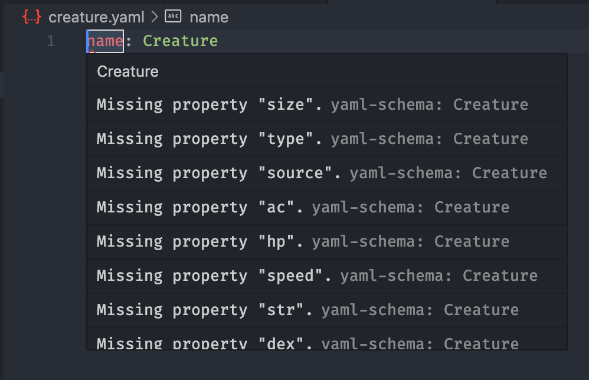
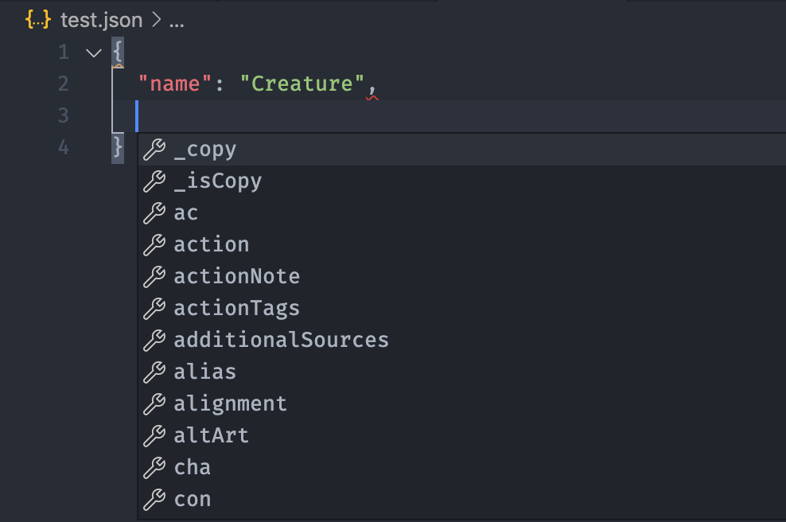
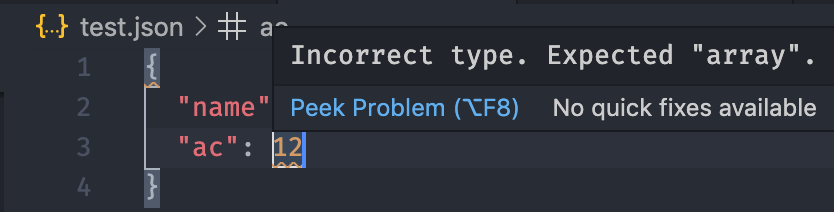

# 5e Schemas

This is a collection of schemas for use when writing homebrew for [5e.tools](https://5e.tools). They help provide autocomplete when using big brain editors like [VS Code](https://code.visualstudio.com/) (which you should use if you aren't).

## Usage

### JSON

Inline JSON schema will give you a warning that the "\$schema" property is invalid. That's because here it acts just like any other one. I don't recommend using inline JSON schemas. Instead, you should set up some workspace settings. See [this](https://code.visualstudio.com/Docs/languages/json#_json-schemas-and-settings) for more info.

#### YAML

YAML inline properties work through comments, so these are a lot more usable. [This](https://github.com/redhat-developer/vscode-yaml#associating-a-schema-to-a-glob-pattern-via-yamlschemas) shows all the different ways you can set them up.

## About

All of these are slightly modified from the 5e.tools GitHub repo to avoid using `$$merge`, a custom preprocessor tag to allow for better JSON Schema inheritance. The ones in the repo can use this because the files are first passed through a script that actually evaluates them. Unfortunately, VS Code and pretty much anything else doesn't know how to do this, so I went in and replaced each `$$merge` with something functionally equivalent (I hope :)) ).
